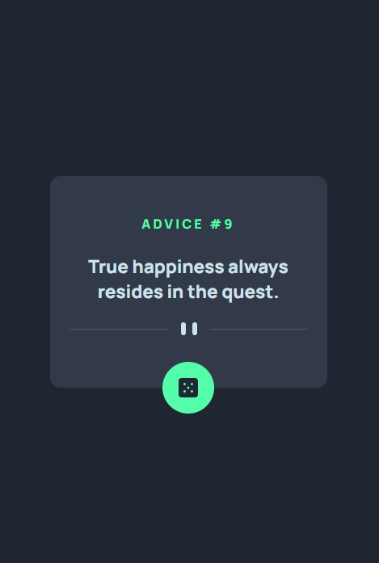
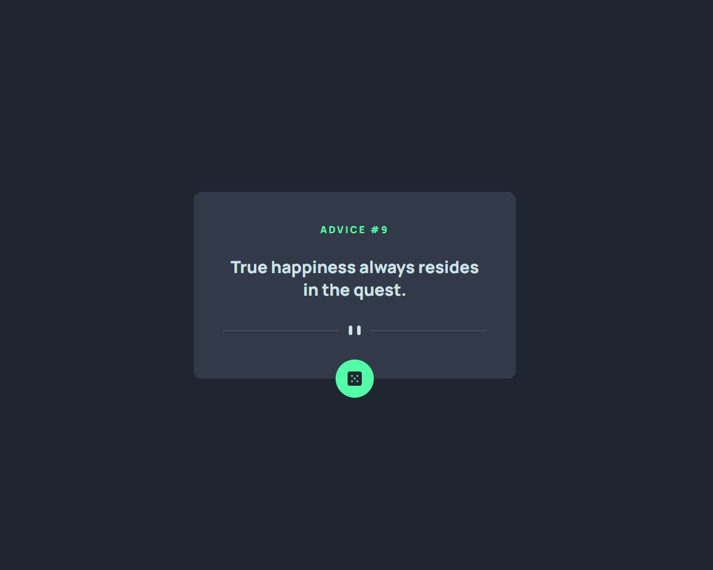

# Frontend Mentor - Advice generator app

This is a solution to the [Advice generator app challenge on Frontend Mentor](https://www.frontendmentor.io/challenges/advice-generator-app-QdUG-13db).

## The challenge

Users should be able to:

- View the optimal layout for the app depending on their device's screen size
- See hover states for all interactive elements on the page
- Generate a new piece of advice by clicking the dice icon

## Links

- [Code](https://brankobozo.github.io/advice-generator-app/)
- [live](https://brankobozo.github.io/age-calculator-app/)

## Tools

- Semantic HTML5 markup
- CSS Custom properties
- JS fetch
- JSON api

## Screenshots

